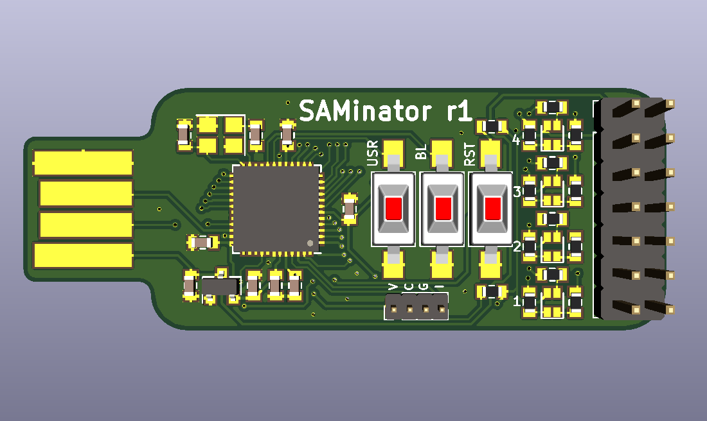
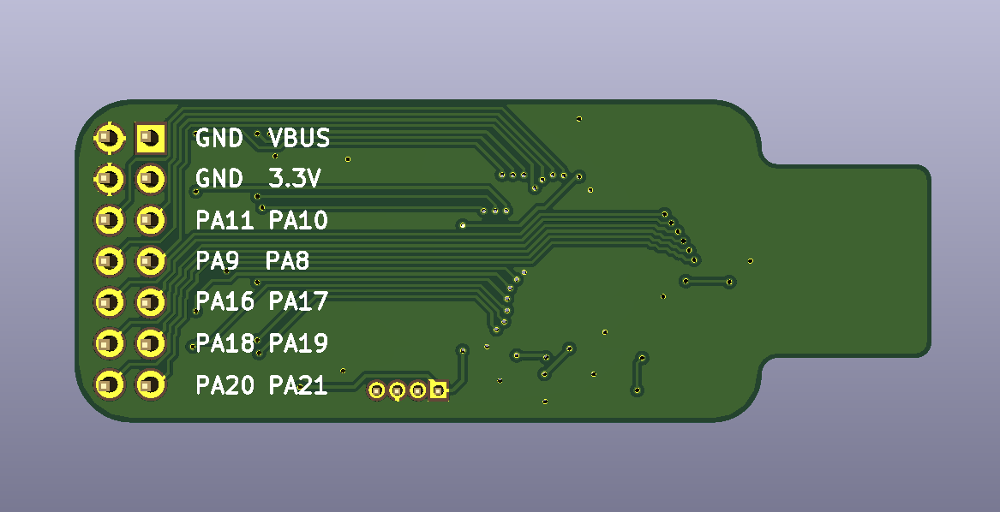
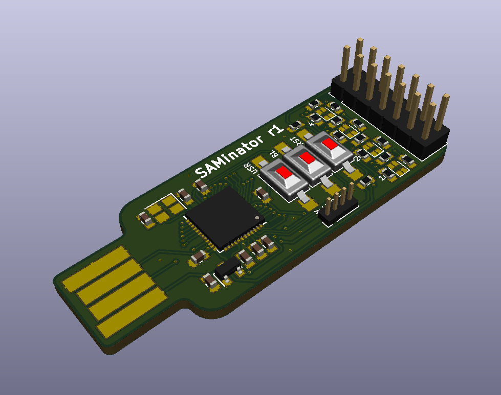

# Atmel/Microchip SAM D21 breakout board aka. SAMinator

A SAM D21 breakout board designed to fit into a USB connector.

Never got it printed in 2.2mm, but tested and worked in 1.6mm with some back support.

